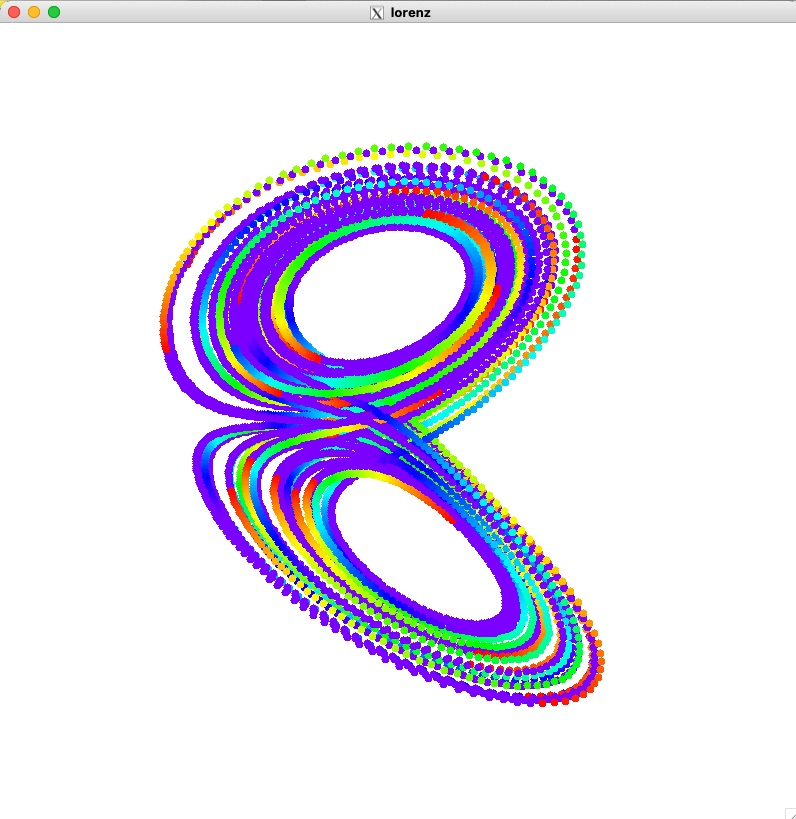

# Lorenz-Attractor

This program calculates the Lorenz Attractor using the [GSL](https://www.gnu.org/software/gsl/) for differential equation solver and [EGGX](https://www.ir.isas.jaxa.jp/~cyamauch/eggx_procall/index.html) for graphics. Compile the code with the following command.

make

From the book ["Computer simulation with C and EGGX"](http://web.cc.iwate-u.ac.jp/~nisidate/main.pdf).

[Kazume NISHIDATE](https://sites.google.com/site/nisidatelab/file-cabinet/the-team?authuser=0)

